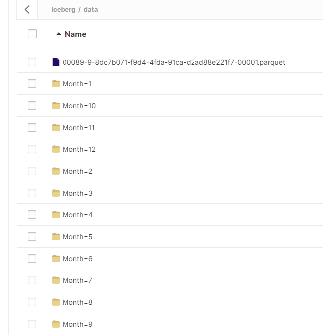
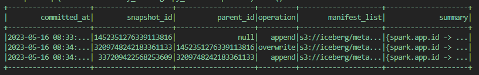

# Minio + Apache Iceberg + JDBC Catalog

## Getting started 

---

Iceberg is an open table format that brings simplicity of SQL table making possible for engines like Spark, Trino, Flink, Presto, Hive and Impala to work at the same time with the same tables.
It is suitable for data lake architectures and ofers good reliability and performance, this are some of the requirements for ACID transactions.
Using Apache Iceberg improves some of the main problems of Hive:

- Easy and realiable *Schema Evolution*

There is no worry in making schema changes in terms of data loss. For example, we can add or rename columns as fast as it's said or even change column's type or move it's position. When a change is made, it just changes the metadata so this means they are executed very quickly.

- Change *Partitioning*

Changing partition for new written data is very easily. After this change, we will have old and new partition scheme together. When a query is made, the *WHERE* clause just knows wether to look for data. Also, there is no need to generate partition values for rows in a table and consumers don't need to know how the table is partitioned to make a query. This Apache Iceberg feature is know as 'Hidden Partitioning'.
More info here: <url>https://iceberg.apache.org/docs/latest/partitioning/</url>


*Source: https://iceberg.apache.org*

- Possibilities to *Time Travel* and *Rollback*

Talking about Time Travel option, you can query results from a point in time by accesing snapshots that Iceberg makes each time there is a new version.
Same can be applied to rollback the table to a previous snapshot version.

- Use of *Expressive SQL* for row changes

This feature makes it handy to do very specific data changes in tables. For example, we can just delete the records that match a specific filter using the *WHERE* clause.

## Iceberg schema

---

Iceberg is an open table format that brings simplicity of SQL table making possible for engines like Spark, Trino, Flink, Presto, Hive and Impala to work at the same time with the same tables.


*Source: https://iceberg.apache.org/spec/*

Metadata.json >> (Snaphot) Manifest list ['Manifest files location']>> Manifest files (.avro for each snapshot)

- <ins>Metadata files (Json Format)</ins>:

Stores informaton about table schema, partition, and snapshot details.

- <ins>Manifest list</ins>:

Store information about manifest files that are part of a snapshot. How many data files added, deleted with partition boundaries.

- <ins>Manifest file</ins>:
  
List of datafiles stored in .parquet format along with other informations. 

- <ins>Data files</ins>:
  
In parquet, ORC or AVRO format that store row data

Therefore, SQL operations cand affect to Metadata layer or Data layer:

* Metadata layer: All queries related to tables (add, alter, drop, rename, update)
* Data layer: All queires related to rows and data (insert, delete, etc..)

Metadata related queries work faster as it works with JSON files.
   
## Notebooks
---

The *iceberg-rest* container loads a jupyter server with several Iceberg Notebooks that contain different usages and test to better undertand Apache Iceberg capabilities.
It can be accessed by the local host on port 8888:
```
localhost:8888
```

## Procedure
---

In this example we are going to load a SP500 dataset from Yahoo Finance into a table.
Data is stored in a MinIO bucket using Apache Iceberg schema and implementing a JDBC Catalog within a Postgres database. Also, we benefit from S3 File IO increasing read and write performance by processing multiple concurrent requests in parallel (not in this example but as it should be in a real case).
In order to test some of Iceberg capabilities we will try some queries in pyspark.

<ins>Main ingredients</ins>

- Apache Iceberg open table format
- Minio server + Minio client
- S3 File IO implementation
- JDBC Catalog implementation
- Postgres DB + PGAdmin
- Spark 3.3.2
  
---

1. Start the cluster by typing on console
   
```
docker compose up -d
```

2. Start py-spark client in *spark-iceberg* container

```
docker compose exec spark-iceberg py-spark
```

3. Create a table (Note that location points to 'Iceberg' bucket created in MinIO server)

```
spark.sql('CREATE TABLE my_catalog.spy_data ( \
Date date, \
Open double, \
High double, \
Low double, \
Close double, \
Adj_Close double, \
Volume integer) \
USING iceberg \
LOCATION "s3://iceberg/"')
```

Let's check in Postgres what happened. We see two tables, they were created on startup by JDBC driver ...


But now we have a row with table info


5. Import data to table (Only the first 10 years)
   
```
from pyspark.sql.functions import *

-- import spy_data.csv
df = spark.read.csv('/home/iceberg/data/spy_data.csv',header=True,inferSchema=True)

-- cast Date field to date type (InferSchema sets to timestamp)
df = df.withColumn("Date",to_date("Date"))

-- filter only 10 first years
df_10 = df.filter('Date >= "1993-01-01" AND Date <= "2003-12-31"')

-- write data to table 
df_10.writeTo('my_catalog.spy_data').append()
```

Table creation and data insert now should be ok

```
spark.sql('select * from my_catalog.spy_data').show()
```


6. Rename table to *spy_table* 

```
-- change table name
spark.sql('ALTER TABLE my_catalog.spy_data \
RENAME TO spy_table')
```

7. Add column month and set it as partition field
   
```
-- add column month after date column
spark.sql('ALTER TABLE my_catalog.spy_table ADD COLUMN Month int AFTER Date')

-- fill with month number
spark.sql('UPDATE spy_table SET month = MONTH(Date)')

-- add a month as partition field from now on
spark.sql('ALTER TABLE my_catalog.spy_table ADD PARTITION FIELD Month')

```

Everything works flawless thanks to <ins>*schema evolution*</ins> feature from Iceberg.

8. Insert the next 10 year values

```
-- add month column to original dataframe
df = df.withColumn('Month',month(df.Date))

-- filter only 10 following years
df_20 = df.filter('Date >= "2004-01-01" AND Date <= "2023-12-31"')

-- write data to table 
df_20.writeTo('my_catalog.spy_table').append()
```

Now we see a partition folders in Minio browser only for this new created data:



If we do a query everything seems to be normal ...

```
spark.sql('select * from spy_table where Date >= "2000-01-01" and Date <= "2010-01-01" order by Date desc').show()
```


But for date < "2004-01-01" Iceberg is looking for files without partition and for >= "2004-01-01" date looks into Month partition files.
For us as users we don't need to know about how table is partitioned to do a query.

This feature is known as <ins>*hidden partitioning*</ins>

9. Now let's try <ins>*time travel*</ins> and <ins>*roll-back*</ins> features

Check for previous snapshots

```
spark.sql('SELECT * FROM my_catalog.spy_table.snapshots').show()
```



If we go back to the first snapshot

```
spark.sql('CALL my_catalog.system.rollback_to_snapshot("spy_table", 1452351276339113816)')
```

We see that Month column is now unfilled (We did the roll-back)


But we cannot roll back to last snapshot again instead we can query it (this is a time-travel example)

```
spark.sql('SELECT * FROM my_catalog.spy_table VERSION AS OF 337209422568253609').show()
```

## Example Queries

---

### Count 

```
spark.sql('SELECT COUNT(1) as count, Geography \
        FROM my_catalog.bank_customers \
        GROUP BY Geography \
        ORDER BY count desc').show()
```

### Schema changes

```
-- rename table

spark.sql('ALTER TABLE my_catalog.my_table \
RENAME TO new_table_name')

-- change column position
spark.sql('ALTER TABLE my_catalog.my_table \
ALTER COLUMN Open \
AFTER High')

```
### Partition changes

```
-- add column month after date column
spark.sql('ALTER TABLE my_catalog.spy_table ADD COLUMN month int AFTER Date')

-- fill with month number
spark.sql('UPDATE spy_table SET month = MONTH(date)')

-- add a month as partition field from now on
spark.sql('ALTER TABLE my_catalog.spy_table ADD PARTITION FIELD month')
```

### Time Travel and Rollback

View timestamp/version

```
-- time travel to October 26, 1986 at 01:21:00
SELECT * FROM my_catalog.my_table TIMESTAMP AS OF '1986-10-26 01:21:00';
```
```
-- time travel to snapshot with id 10963874102873L
SELECT * FROM my_catalog.my_table VERSION AS OF 1684149281931;
```

Rollback

```
-- call back table to July 25, 2022 at 12:15:00
CALL my_catalog.system.rollback_to_timestamp('my_table', TIMESTAMP ‘2022-07-25 12:15:00.000’); 
```
```
-- call back table to snapshot with id 527713811620162549L
CALL my_catalog.system.rollback_to_snapshot('my_table', 1452351276339113816);
```

### Displays 

---

Data files

```
-- display all files from my_table
SELECT * FROM my_catalog.my_table.files;
```

Manifest files 

```
-- display all manifest files from my_table
SELECT * FROM my_catalog.my_table.manifests;
```

Table history

```
-- show history from my_table
SELECT * FROM my_catalog.my_table.history;
```

Snapshots

```
-- show my_table snapshots
SELECT * FROM my_catalog.my_table.snapshots;
```

Joins (Snapshots + History)

```
select
    h.made_current_at,
    s.operation,
    h.snapshot_id,
    h.is_current_ancestor,
    s.summary['spark.app.id']
from my_catalog.spy_table.history h
join my_catalog.spy_table.snapshots s
    on h.snapshot_id = s.snapshot_id
order by made_current_at;
```
